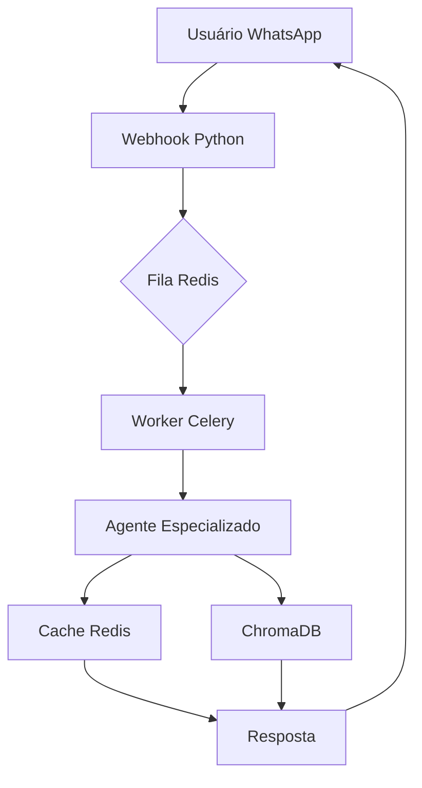

# ⚖️ IA Jurídica PY

**Sistema de Inteligência Artificial para preparação de concursos públicos no Paraguai**


## 📋 Visão Geral

Plataforma de estudos para concurseiros paraguaios utilizando IA generativa e RAG para questões personalizadas e acompanhamento de desempenho.

### 🎯 Problema
- Acesso limitado a materiais de qualidade no Paraguai
- Questões genéricas não preparam para bancas específicas
- Dificuldade em acompanhar evolução
- Cursinhos presenciais caros e com horários fixos

### 💡 Solução
- Base com **11.000+ questões reais**
- **Agentes de IA especializados** por área do direito
- Acesso via **WhatsApp**
- **Personalização** baseada no desempenho
- **Dashboard completo** de evolução

---

## 🏗️ Arquitetura



### Componentes Principais

| Componente | Tecnologia | Função |
|------------|------------|--------|
| **Frontend** | Next.js 14, TypeScript, Tailwind | Interface e dashboards |
| **Backend** | Java 17, Spring Boot, JPA | Regras de negócio e assinaturas |
| **Agents** | Python 3.11, FastAPI, LangChain | IA, RAG e embeddings |
| **Banco Vetorial** | ChromaDB | Busca de questões |
| **Cache** | Redis | Cache semântico e filas |
| **Dados** | PostgreSQL | Dados transacionais |
| **WhatsApp** | Meta Business API | Canal de atendimento |
| **Pagamentos** | Bancard/Pagopar | Gateway paraguaio |
| **BI** | Metabase | Dashboards analíticos |

---

## 📊 Fases do Projeto (300 dias)

| Fase | Período | Foco Principal | Status |
|------|---------|----------------|--------|
| **Fase 1** | Dias 1-30 | Fundação + Base de Dados | ▶️ Em andamento |
| **Fase 2** | Dias 31-60 | Agentes Especializados | ⏳ Pendente |
| **Fase 3** | Dias 61-90 | Backend Java + Regras | ⏳ Pendente |
| **Fase 4** | Dias 91-120 | Frontend Next.js | ⏳ Pendente |
| **Fase 5** | Dias 121-150 | Expansão MP/Defensoria | ⏳ Pendente |
| **Fase 6** | Dias 151-180 | WhatsApp Bot + Pagamentos | ⏳ Pendente |
| **Fase 7** | Dias 181-210 | Analytics e Evals | ⏳ Pendente |
| **Fase 8** | Dias 211-240 | Expansão Concursos Gerais | ⏳ Pendente |
| **Fase 9** | Dias 241-270 | Escalabilidade | ⏳ Pendente |
| **Fase 10**| Dias 271-300 | Lançamento | ⏳ Pendente |

📅 **[Acesse o Cronograma Detalhado](cronograma.html)**

---

## 🚀 Funcionalidades

### ✅ Implementadas (Fase 1)
- [x] Extração de texto de PDFs
- [x] Chunking inteligente por questão
- [x] Embeddings multilíngue
- [x] Armazenamento em ChromaDB
- [x] Metadados (banca, ano, disciplina)
- [x] API básica de busca (FastAPI)
- [x] Docker-compose local

### 🔄 Em desenvolvimento (Fase 2)
- [ ] Agentes especializados (Constitucional, Processual)
- [ ] Tools de consulta a leis e jurisprudência
- [ ] Memória de curto prazo para agentes
- [ ] API de usuários e histórico

### 📋 Próximas funcionalidades
- [ ] Integração com WhatsApp
- [ ] Pagamentos em guaranis (Bancard)
- [ ] Dashboard Metabase
- [ ] Cache semântico Redis
- [ ] App mobile (React Native)

---

## 🛠️ Stack Tecnológica

- **Backend & IA:** Python 3.11, FastAPI, LangChain, ChromaDB, Java 17, Spring Boot 3, PostgreSQL 15, Redis 8.0
- **Frontend:** Next.js 14, TypeScript, Tailwind CSS, shadcn/ui, React Query, Recharts
- **DevOps:** Docker, Docker Compose, GitHub Actions, Vercel

---

## 📁 Estrutura do Repositório

```
ia-juridica-py/
├── agents-python/       # Agentes IA (FastAPI)
├── business-java/       # Backend (Spring Boot)
├── frontend-next/       # Frontend (Next.js)
├── whatsapp-bot/        # Bot WhatsApp
├── docs/                # Documentação e Cronograma
├── scripts/             # Scripts utilitários
├── docker-compose.yml   # Orquestração
├── .env.example         # Variáveis de ambiente
├── LICENSE              # Licença MIT
└── README.md
```

---

## 🚀 Como Executar Localmente

### Pré-requisitos
- Docker e Docker Compose
- Git
- 8GB RAM mínimo (16GB recomendado)

### Passo a Passo

```bash
# 1. Clone o repositório
git clone https://github.com/seu-usuario/ia-juridica-py.git
cd ia-juridica-py

# 2. Configure as variáveis de ambiente
cp .env.example .env

# 3. Inicie os serviços
docker-compose up -d

# 4. Acesse
# Frontend: http://localhost:3000
# API Java: http://localhost:8080
# API Python: http://localhost:8000/docs
# Metabase: http://localhost:3001
```

### Comandos Úteis

```bash
# Logs
docker-compose logs -f agents-python

# Migrações
docker-compose exec business-java ./mvnw flyway:migrate

# Backup Vetorial
docker-compose exec agents-python python scripts/backup_chroma.py
```

### Configuração (.env.example)

```env
# Database
DB_HOST=postgres
DB_PORT=5432
DB_NAME=juridico_py
DB_USER=admin
DB_PASSWORD=secret

# Redis
REDIS_HOST=redis
REDIS_PORT=6379

# APIs
AGENTS_API_URL=http://agents-python:8000
JAVA_API_URL=http://business-java:8080

# WhatsApp
WHATSAPP_TOKEN=seu_token_aqui
WHATSAPP_PHONE_ID=seu_phone_id

# Pagamento
BANCARD_MERCHANT_ID=seu_merchant_id
BANCARD_SECRET=seu_secret

# JWT
JWT_SECRET=seu_jwt_secret
JWT_EXPIRATION=86400
```

---

## 📊 Cronograma de Desenvolvimento

Acesse o cronograma interativo em `docs/cronograma.html`:
- ✅ Marque dias concluídos
- 📈 Visualize progresso
- 🔍 Filtre por fase
- 💾 Salve progresso automaticamente


---

## 🤝 Contribuição

Sugestões são bem-vindas!

1. Fork o projeto
2. Crie uma branch (`git checkout -b feature/sugestao`)
3. Commit (`git commit -m 'Adiciona sugestão'`)
4. Push (`git push origin feature/sugestao`)
5. Pull Request

**Sugestões:** Issues para bugs, feedback no cronograma, indicação de PDFs de concursos.

---

## 📈 Roadmap 2026

| Período | Marcos |
|---------|--------|
| Q1 2026 | Fases 1-3: Base + Agentes + Backend |
| Q2 2026 | Fases 4-6: Frontend + WhatsApp + Pagamentos |
| Q3 2026 | Fases 7-9: Analytics + Expansão + Escala |
| Q4 2026 | Fase 10: Lançamento oficial |

---

## 📬 Contato

- **Email:** seu-email@exemplo.com
- **LinkedIn:** Seu Perfil
- **GitHub:** @seuusuario

---

## 📄 Licença

Este projeto está sob a licença [MIT](LICENSE).

---

## 🙏 Agradecimentos

- Comunidade de concurseiros paraguaios
- Open source community (LangChain, ChromaDB, Next.js)
- Mentores e colaboradores

---

> ⚖️ **IA Jurídica PY** - Preparação inteligente para concursos no Paraguai


